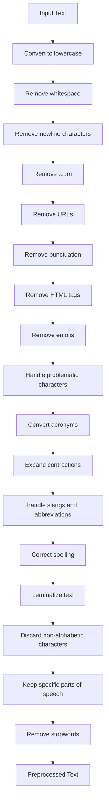

# Intensity Analysis: Emotion Classification


This project aims to predict emotions from text data using various machine learning and deep learning models. It includes preprocessing steps, different vectorization techniques, and a Streamlit web application for interactive predictions.

## Table of Contents

- [Project Overview](#project-overview)
- [Dataset](##dataset)
- [Data Preprocessing](#data-preprocessing)
- [Models Used](#models-used)
- [Project Structure](#project-structure)
- [Installation](#installation)
- [Usage](#usage)
- [Streamlit App](#streamlit-app)
- [Conclusion](#conclusion)

## Project Overview

The main goal of this project is to predict emotions such as happiness, anger, and sadness from textual data. We employed various models and vectorization techniques to find the best performing model.

## Dataset

The dataset used in this project consists of WhatsApp chat data from Indian users. This data presents unique challenges as many Indian users often type in their native languages using the English script, which includes a lot of slang and colloquial expressions. For example, the word "khatarnaak" (खतरनाक), which means "dangerous" in Hindi, is often used to describe something intense or impressive in a positive way. This linguistic mix makes it challenging for models to accurately interpret and predict emotions.

Despite these challenges, the best performing model, which uses a Linear SVM with Word2Vec, achieved a validation accuracy of 73%.

## Data Preprocessing

The text preprocessing pipeline includes the following steps:
1. Convert to lowercase
2. Remove whitespace
3. Remove newline characters
4. Remove ".com" substrings
5. Remove URLs
6. Remove punctuation
7. Remove HTML tags
8. Remove emojis
9. Handle problematic characters within words( ’, iâm, 🙠and so on)
10. Convert acronyms
11. Expand contractions
12. handle slangs and  abbreviations
13. Correct spelling
14. Lemmatize text
15. Discard non-alphabetic characters
16. Keep specific parts of speech
17. Remove stopwords

### Text-Preprocessing Pipeline Flowchart


## Models Used
10 models were Tested for each vectorization method,
Best performed:

1. TF-IDF Vectorizer with XGBoost
2. Bag of Words (BoW) Vectorizer with XGBoost
3. Word2Vec with Linear SVM
4. GloVe with Bidirectional LSTM

## Project Structure
```
├── Datasets/
|   ├── angriness.csv
|   ├── happiness.csv
|   ├── sadness.csv
├── assets/
|   ├── comment.png
|   ├── streamlit app overview.png
├── streamlit app/
|   ├── pkl files/
│   |  ├── best_xgb_model.pkl
│   |  ├── bow_vectorizer.pkl
│   ├── main.py
│   ├── text_normalization.py
│   ├── requirement.txt
├── emotion_classificatiom.ipynb
├── project report.pdf
├── README.md
```

## Installation
1. Clone the repository:
```ruby
git clone [https://github.com/your-repo/emotion-prediction.git](https://github.com/vn33/Intensity-Analysis-EmotionClassification.git)
```
2. Install the dependencies:
```ruby
pip install -r streamlit app/requirement.txt
```
3. Download necessary NLTK data:
```ruby
import nltk
nltk.download('punkt')
nltk.download('averaged_perceptron_tagger')
nltk.download('stopwords')
```
4. Download Spacy model:
```ruby
python -m spacy download en_core_web_sm
```

## Usage
Run the Streamlit app:
```ruby
streamlit run app.py
```
Enter text into the input box and click "Predict" to see the emotion prediction.

## Streamlit App
The Streamlit app allows users to input text and get an emotion prediction. It uses the pre-trained models and vectorizers to preprocess the text and make predictions.

## Conclusion
This project demonstrates the use of various text preprocessing techniques and machine learning models to predict emotions from text. Despite the challenges posed by the unique linguistic characteristics of the dataset, we achieved a validation accuracy of 73% with our best model. The Streamlit app provides an interactive way to test the models and see their predictions in real-time.
